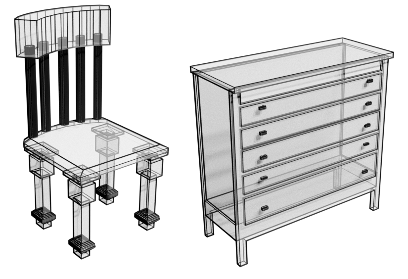

# Repository Overview

This is a copy of the official DeepMind repository for the PolyGen model. 
This repository includes a working Dockerfile to install the dependencies, download the pretained models and run the inference. 
Warning: inference only works on CPU. Due to some trouble, I was not able to run the inference on GPU.

# PolyGen: An Autoregressive Generative Model of 3D Meshes




This package provides an implementation of PolyGen as described in:

> **PolyGen: An Autoregressive Generative Model of 3D Meshes**, *Charlie Nash, Yaroslav Ganin, S. M. Ali Eslami, Peter W. Battaglia*, ICML, 2020. ([abs](https://arxiv.org/abs/2002.10880))

PolyGen is a generative model of 3D meshes that sequentially outputs mesh
vertices and faces. PolyGen consists of two parts: A vertex model, that
unconditionally models mesh vertices, and a face model, that models the mesh
faces conditioned on input vertices. The vertex model uses a masked Transformer
decoder to express a distribution over the vertex sequences. For the face model
we combine Transformers with [pointer networks](https://arxiv.org/abs/1506.03134)
to express a distribution over variable length vertex sequences.

In this repository we provide model code in `modules.py`, as well as data
processing utilities in `data_utils.py`. We also provide Colabs that demo
training PolyGen from scratch on a toy dataset, as well as sampling from a
pre-trained model.

There are some minor differences between this implementation and the paper:
* We add global information (e.g. class label embeddings) as an additional input in the first sequence position rather than project it at each layer. This reduces parameters, but does not significantly impact performance.
* We use [ReZero](https://arxiv.org/abs/2003.04887) which improves training speed.
* We train with only shifting augmentations, which we find to be as effective as the combination of augmentations described in the paper. This helps to simplify the data pre-processing pipeline.

## Training Colab [](https://colab.research.google.com/github/deepmind/deepmind-research/blob/master/polygen/training.ipynb)

To train a PolyGen model from scratch on a collection of simple meshes use this
colab. This demonstrates the data pre-processing required to create inputs for
the vertex and face models.

## Sampling pre-trained model Colab [](https://colab.research.google.com/github/deepmind/deepmind-research/blob/master/polygen/sample-pretrained.ipynb)

To sample a model pre-trained on [ShapeNet](https://www.shapenet.org/)
use this colab. The model is class-conditional, and is trained on longer
sequence lengths than those described in the paper. This colab uses the
following checkpoints: ([Google Cloud Storage
bucket](https://console.cloud.google.com/storage/browser/deepmind-research-polygen)).

## Installation

To install the package locally run:
```bash
git clone https://github.com/deepmind/deepmind-research.git .
cd deepmind-research/polygen
pip install -e .
```

## Giving Credit

If you use this code in your work, we ask you to cite this paper:

```
@article{nash2020polygen,
  author={Charlie Nash and Yaroslav Ganin and S. M. Ali Eslami and Peter W. Battaglia},
  title={PolyGen: An Autoregressive Generative Model of 3D Meshes},
  journal={ICML},
  year={2020}
}
```

## Disclaimer

This is not an official Google product.
